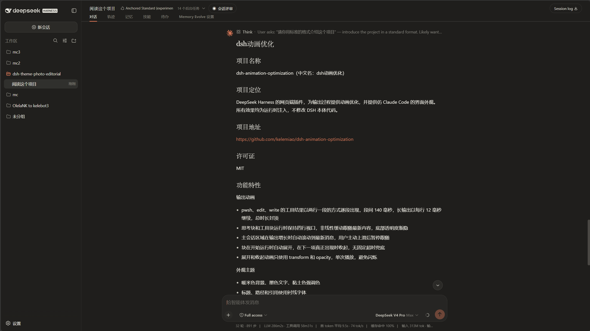
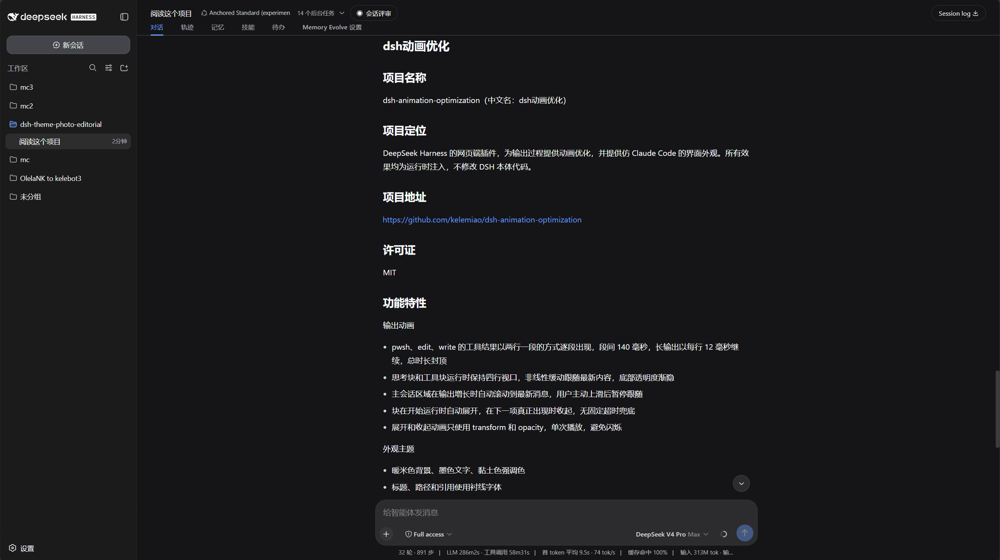
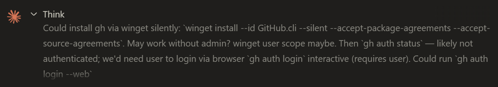

# dsh动画优化

给 DeepSeek Harness 用的客户端插件。它把 Claude Code 风格的外观带进网页界面，同时把思考块和工具输出的展示方式改造成更像实时流的样子。

DSH 后端把工具结果一次性送到页面，这个插件在显示层把它们分段播放出来。文字逐段出现，滚动跟着新内容走，块在开始运行时自动展开，在下一条内容真正出现时才收起。所有效果都在运行时注入，不会修改 DSH 本体。关掉插件，界面就回到 DSH 原来的样子。

## 截图

### Claude 配色界面



### DSH 原版配色界面



### 思考中的动画



## 改了哪些动画

思考和 pwsh、edit、write 工具在运行时会保持四行高的视口。视口用缓动曲线跟随最新内容，底部有透明度渐隐。用户真正向上滚动时自动跟随会暂停，不会和阅读抢控制权。

工具输出的行按两行一段出现，段与段间隔 140 毫秒，每行用 0.5 秒的透明度和位移过渡进入。长终端输出会以每行 12 毫秒继续，整体封顶在 3.8 秒左右，这样下一块的收起不会被无限拖住。最快的 edit 和 write 调用往往在状态已经变成完成后才渲染出内容，这种情况同样会走分段播放。

思考块和工具块在进入运行状态时自动展开一次。结束后先保持展开，等文档流里的下一条内容真正挂载出来才播放关闭动画。没有超时兜底，不会在下一项还没出现时提前收起，也不会随便等一个固定秒数。运行时的 96px 视口钳制会保留到关闭动画结束，避免整段内容闪现一帧。

打开和关闭动画都只动 transform 和 opacity，一次播放，不循环。

## 外观

暖米色底、墨色文字和黏土色强调色来自颜色 token 层。标题、路径和引用使用衬线字体，来自字体层。Claude 星爆头像和思考指示器由 logo 层控制。三个层互相独立，可以只保留 Claude 字体而用 DSH 原版配色，反过来也可以。

插件默认开启完整 Claude 全套：配色、字体、logo 都是开着的。如果只想要动画优化、不想要外观改动，在设置里关闭 Claude 配色和 Claude 字体即可，展开收起、流式输出、自动跟随这些行为层动画不受影响，界面会回到 DSH 原版外观。

## 安装

```sh
dsh plugin --profile web add link:C:/path/to/dsh-animation-optimization
```

在 `~/.dsh/profiles/web/cordis.patch.yml` 里注册：

```yaml
- insert:
    - id: dsh-animation-optimization
      name: dsh-animation-optimization
```

重启 `dsh web`，浏览器强制刷新一次。如果你之前安装的是旧名字 `dsh-theme-photo-editorial`，把上面两处 id 和 name 改成新名字即可。

## 设置

插件在 DSH 设置里注册了三个开关，通用设置里各有一条紧凑入口，Photo Editorial 主题分区页里有完整三行。

Claude Logo 控制星爆头像和流式指示器。Claude 配色在编辑风格配色和 DSH 原版 token 之间切换，暗色模式同样适用。Claude 字体在衬线字体和 DSH 默认字体栈之间切换。三个选择都存在浏览器 localStorage 里，点击后立即生效。

## 结构与测试

宿主侧 `lib/index.js` 是无逻辑的 cordis 入口。客户端 `lib/client.js` 是单个无构建步骤的 bundle，运行时注入三层样式（行为、颜色 token、字体），并通过 MutationObserver 驱动展开收起状态机。测试在 `test/client.test.js`，用 VM 假 DOM 运行，不需要浏览器。

```sh
npm test
```

## License

MIT

---

# dsh animation optimization

A client-side plugin for DeepSeek Harness that brings a Claude Code-inspired
look to the web UI and presents thinking blocks and tool output as a live
stream instead of finished blocks.

DSH delivers tool results all at once. This plugin replays them visually:
lines surface in small chunks, the viewport follows the newest content, and
disclosure blocks open when they start running and close only when the next
item actually exists. Everything is injected at runtime. Removing the plugin
returns DSH to its original behavior.

## Screenshots

### Claude UI


### Original DSH UI


### Thinking animation


## Animation changes

Thinking blocks and pwsh, edit, and write tools keep a four-line viewport
while running. The viewport follows new content with an ease-out glide and a
soft opacity fade at the bottom edge. A real user scroll-up pauses the
auto-follow.

Tool lines appear in two-line chunks, 140ms apart, each line entering through
a 0.5s opacity and transform transition. Long terminal output continues at
12ms per line, capped near 3.8s so the next disclosure is not delayed. The
fastest edit and write calls render their lines after the state has already
flipped to done; those late lines stream the same way.

Disclosures auto-open once when running. After finishing they stay open until
the next item actually mounts in the document flow, then play a one-shot
closing animation. There is no timeout fallback, so nothing closes before its
successor exists. The running viewport clamp survives until the closing
animation finishes, which prevents a full-height flash for one frame.

Open and close animations animate only transform and opacity, once, never in
a loop.

## Appearance

The warm ivory palette, ink text, and clay accent come from the color token
layer. Headings, paths, and quotes use the serif font layer. The Claude
starburst avatar and streaming indicator come from the logo layer. The layers
are independent: Claude fonts can be combined with the original DSH palette
and the other way around.

The full Claude set is enabled by default: colors, fonts, and logo all start
on. To keep only the animation optimization and drop the restyling, turn off
Claude Colors and Claude Font in settings. The behavior layer — disclosure
timing, streaming reveal, and auto-follow — keeps running, and the UI returns
to the original DSH appearance.

## Install

```sh
dsh plugin --profile web add link:C:/path/to/dsh-animation-optimization
```

Register it in `~/.dsh/profiles/web/cordis.patch.yml`:

```yaml
- insert:
    - id: dsh-animation-optimization
      name: dsh-animation-optimization
```

Restart `dsh web` and hard-refresh the browser. If you installed the old name
`dsh-theme-photo-editorial`, replace both id and name with the new one.

## Settings

Three switches are registered in DSH Settings: compact rows under General and
a full section page. Claude Logo controls the starburst avatar and streaming
indicator. Claude Colors switches between the editorial palette and the
original DSH tokens, dark mode included. Claude Font switches between the
serif stack and the default DSH fonts. All choices live in browser
localStorage and apply instantly.

## Structure and tests

`lib/index.js` is the no-op cordis host entry. `lib/client.js` is a single
build-free bundle that injects three stylesheet layers (behavior, color
tokens, fonts) and drives the disclosure state machine through a
MutationObserver. Tests in `test/client.test.js` run against a VM fake DOM.

```sh
npm test
```

## License

MIT
